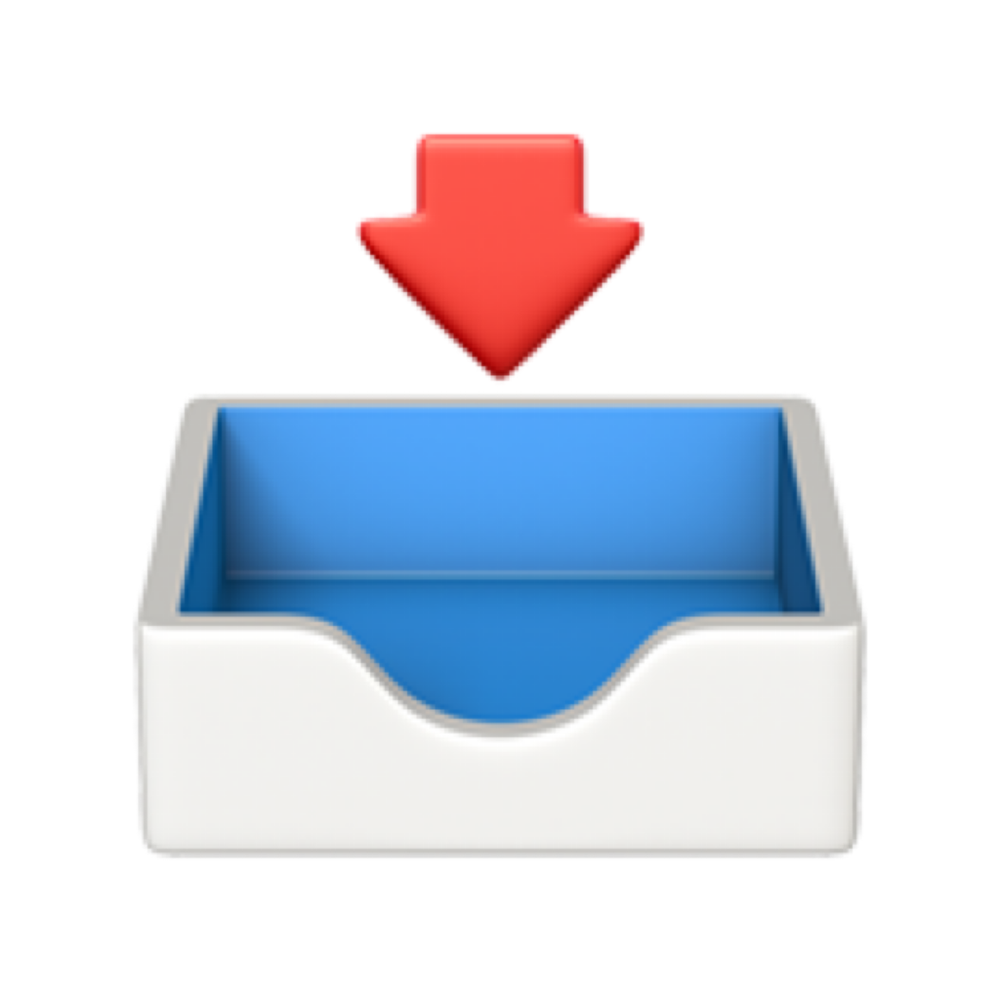

<p align="center">
  
</p>

# Mercury

A tiny, free, open-source macOS menubar app that watches your Gmail inbox
over IMAP **IDLE** and fires a native notification the instant new mail
arrives — no polling, no need to keep Mail.app open, no Dock icon, no
telemetry.

## Why this is faster than Mail.app

Mail.app polls Gmail on its own schedule and can lag noticeably, especially
when the app isn't frontmost. Mercury opens a single persistent IMAP
connection and uses the `IDLE` command (RFC 2177), so Gmail's server pushes
an event to it the moment a message lands — no polling interval to wait out.

## Install

### Option A: Download the prebuilt app

Grab the latest `.zip` from [Releases](../../releases), unzip it, and drag
`Mercury.app` to `/Applications`.

Mercury is **ad-hoc signed**, not notarized by Apple (notarization requires
a paid Apple Developer account), so on first launch Gatekeeper blocks it
with "Apple could not verify 'Mercury.app' is free of malware." This is
normal for a free ad-hoc-signed app and only needs fixing once — the
usual right-click → Open trick does **not** work here (that only bypasses
Gatekeeper for Developer-ID-signed-but-unnotarized apps, not ad-hoc ones).
Instead, do one of:

- **Terminal (easiest):** `xattr -cr /Applications/Mercury.app`, then open
  it normally.
- **System Settings:** Privacy & Security → scroll to the Security section
  → click **Open Anyway** next to the Mercury.app warning → authenticate →
  try opening the app again and confirm the final dialog.

### Option B: Build it yourself

Requires only Xcode Command Line Tools (`xcode-select --install`) — no full
Xcode needed:

```bash
git clone https://github.com/FireBarret/mercury.git
cd mercury
./build_app.sh
open build/Mercury.app
```

## One-time Google account setup

Gmail's IMAP no longer accepts your normal password for third-party apps, so
you need an **App Password**:

1. Turn on 2-Step Verification: https://myaccount.google.com/signinoptions/two-step-verification
2. Generate an app password: https://myaccount.google.com/apppasswords
3. Keep the 16-character password handy — you'll paste it into Mercury once.

On first launch, Mercury asks for notification permission, then opens a
setup window asking for your Gmail address and the app password. Enter both
and hit "Save & Connect" — a mail icon appears in the menubar and stays
there.

## Using it

- Menubar icon fills in and shows an unread count when you have unread mail.
- The menu shows your **3 most recent messages** (sender + subject) at a
  glance, plus: **Check Now** (force a refresh), **Open Gmail** (opens
  mail.google.com in your browser), **Send Test Notification** (fire a
  notification on demand, useful for confirming permissions are working),
  **Preferences…**, **Quit**.
- New mail triggers a native macOS notification with sender + subject.
  Clicking the notification, or clicking any of the 3 recent messages in the
  menu, opens that exact message **in Mail.app** (via its `message://` link
  scheme) instead of the Gmail web UI. This only works once Mail.app has
  synced that message locally — if Mail.app was closed, it'll launch and
  may take a moment to catch up before the message resolves.
- Preferences has two checkboxes: **Launch at login** and **Show sender &
  subject in notifications** (turn the latter off for a generic "New Mail"
  alert instead, e.g. if you don't want message contents flashing on a
  locked/shared screen).
- Every time new mail arrives, Mercury also briefly opens **Mail.app in the
  background** (no Dock bounce, doesn't steal focus), tells it to check for
  new mail, waits ~10 seconds, then quits it again automatically — but only
  if Mail.app wasn't already open. This keeps Mail.app's own local copy
  fresh so the "open in Mail.app" links above resolve immediately instead of
  needing to wait for Mail.app to catch up. The **first** time this happens,
  macOS will show a one-time "Mercury wants to control Mail" permission
  prompt — approve it (it's just Apple's standard Automation/AppleScript
  permission, same as any app that scripts another).

### Global keyboard shortcut

In Preferences, click the shortcut field under "Open menu shortcut", then
press the key combo you want (e.g. ⌥⌘M) — it's captured immediately, same
as recording a shortcut anywhere else in macOS. Press it any time to pop the
menu open, then use the arrow keys to move through it and Return to select
(that navigation is just standard macOS menu behavior, nothing custom).
"Clear" removes the shortcut.

### If notifications don't show up

macOS only asks for notification permission once per app. If you don't see
a system prompt on first launch, or notifications stay silent, check
**System Settings → Notifications → Mercury** and make sure "Allow
Notifications" is on. Use the **Send Test Notification** menu item to check
this without waiting for real mail. Also note: macOS automatically silences
all banners system-wide while you're screen sharing/mirroring a display —
that's expected behavior, not a bug.

## Run it automatically at login

Tick the "Launch at login" checkbox in Preferences. For this to keep working
across app updates, run Mercury from `/Applications` — macOS ties the
login-item registration to the app's location.

## Privacy & security

- Single Gmail account only (by design, to keep this simple).
- The app password is stored in your macOS Keychain, never in a plain file.
- Mercury only ever talks to `imap.gmail.com:993` over TLS, plus your local
  Keychain/UserDefaults and Mail.app. No analytics, no telemetry, no
  third-party servers.
- It's fully open source — read the code yourself, it's small.
- Not sandboxed and not notarized by Apple. Fine for personal use on your
  own Mac; just know it doesn't have the extra confinement an App Store app
  would.

## Contributing

Issues and PRs welcome. It's intentionally a small, dependency-free
codebase (~1500 lines of Swift, no third-party packages) — please keep
additions in that spirit rather than growing it into a framework.

## License

[MIT](LICENSE) — do whatever you want with it.
